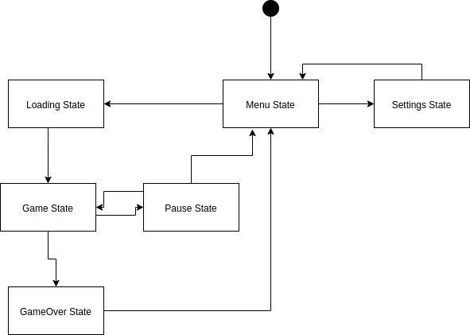

# Projet moteur de jeux "jeu de platformes en 2D": 
Implémentation d'un moteur de jeu généralisé avec l'utilisation de la bibliothèque SFML 2.5.1. Le projet contient toutes les classes nécessaires pour créer un jeu de platformes en 2D. Graphe de scène, game loop, colliders, classes pour les GUI, une FSM pour le menu, le début du jeu, les paramètres et le menu pause.

## Game loop:
On boucle tant que l'interface est active puis on affiche le premier élément dans la liste d'état (initialement le menu). 
- Classes : Application

## Diagramme à état de l'UI:
- Classes: State, StateStack (pile des état), StateIdentifiers (enum pour différencier les état), MenuState (Affichage du menu), LoadingState (chargement des ressources), GameState (lancement de la partie), GameOverState (retour au menu à la fin du jeu), PauseState (mise du jeu en pause), SettingsState (affichage des paramètres) , TitleState (affichage de l'écra, d'accueil)

- Classe Component: permet de déssiner un composant de l'UI utilisant la bibliothèque graphical user interface du c++.  
- Classe Button: hérite de la classe component et permet d'instancier et d'afficher les boutons.
- Classe Container: hérite de la classe composant et permet d'instancier des conteneurs pour afficher les labels et boutons par exemple.
- Classe Label: hérite de la classe component et permet d'instancier du texte.

## Game State:
- Création du personnage avec son état de level initial (LevelRunning)
- Création du monde avec tout ses composants (Graphe de scène).
- Tous les objets de la scènes hérite de la classe Entity. Les données relatifs à chaque entitiés sont stockés dans DataTables.

## Graphe de scène:
- Classe SceneNode: hérite de la classe Transformable, Drawable et NonCopyable. Un noeud étant représenté par un pointeur unique pointant vers ses fils et son père. Les classes desquelles elle hérite permettant de draw le noeud.
- Classe SpriteNode: attacher un sprite à un noeud du graphe de scène.
//graphe de scène

## Gestion des inputs:
- Classe player: attache les événements à la classe PlayerHue et initialise l'état du statut du joueur.
- Classe Command : classe abstraite permettant d'éxécuter les commandes qu'elle reçoit suivant le Pattern Command.
- Classe CommandQueue : une file pour stocker les commande en temps réel.

## Generation de la TileMap:
- Classe Map: hérite de la classe sceneNode, utilise des vertexArray pour attacher une texture à une tile à un rectangle dessiné.
- Utilise un tableau level pour initialiser les tiles de la map puis on attache la map au graphe de scène afin de l'afficher.

## Système de particules:
- Classe EmmiterNode: hérite de la classe SceneNode, sert à emmetre un système de particule selon sa catégory.
- Classe ParticuleNode: hérite de la classe SceneNode, sert à instancier un système de particules avec une queue à double entrée, et utilisant un vertexArray pour dessiner l'effet en l'attachant aux textures de l'effet.
- Classe Particule: enum pour différencier chacun des particules.
- Classe PostEffect: classe permettant d'afficher un effet blooming à la scène utilisant des shaders.
- Classe BloomEffect: héritant de la classe postEffect, permettant d'instancier le bloomEffect selon les shaders donnés.

## Animation:
- Classe Animation permettant de produire des animations à partir de sprites d'animations précalculées.

